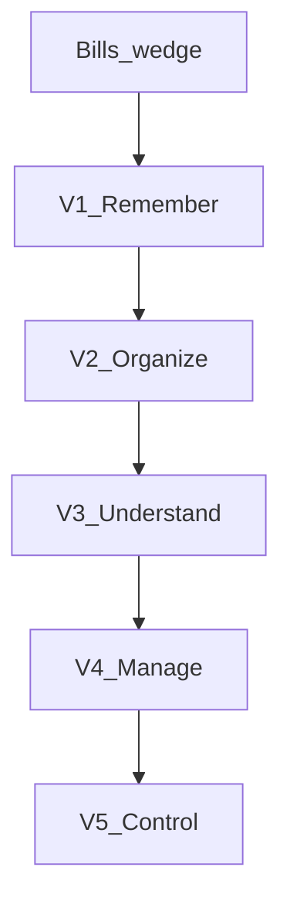

# Yaadu — Indian Household OS (Master Product Spec)

> Product vision and phased roadmap. For the **bills wedge implementation**, see [`YaaduSpec.md`](YaaduSpec.md). For **mobile UI patterns** on the bills wedge, see [`UI.md`](UI.md).

---

## 1. Product thesis

**Core promise:**

> One AI assistant for everything your family needs to remember, buy, pay, maintain and manage.

**Positioning:** Yaadu is a **digital grih-prabandhak** — a household secretary powered by AI — not a "family task manager." Western productivity apps optimize for tasks and calendars; Indian households optimize for **bills, ration, domestic help, society notices, festivals, relatives, vehicles, documents, and informal role-based responsibilities** (Papa pays electricity, Mummy handles grocery, Karan does online payments).

**India-first principles:**

- Natural language in **Hindi, English, and Hinglish** — users never need to learn app vocabulary.
- **WhatsApp-native** habits: many household signals already arrive on WhatsApp; the app should absorb them eventually.
- **Trust through confirm-before-save** — wrong parses that silently commit break trust in week one.

**Wedge strategy:** Ship **one loop done well** (bills + reminders that actually fire) before expanding. If people trust Yaadu enough to keep putting bills into it, groceries, documents, and WhatsApp become natural extensions — not prerequisites for feeling "complete."

---

## 2. How Indians actually talk

The AI must understand real utterances, not English-only command forms.

| User says | System should |
|-----------|----------------|
| "Har Sunday rashan ki list bana dena" | Recurring grocery list + Sunday reminder |
| "Mummy ka birthday 15 September hai, is baar accha gift lena hai" | Person + event + date + reminder chain + gift reminder |
| "Bijli ka bill har mahine 10 tareekh ko aata hai, ₹2000 ke aas paas" | Recurring bill reminder (current wedge) |
| "Gas cylinder book karne ki yaad dila dena" | LPG recurring reminder |
| "Kal doodh lena hai" | Daily essential / shopping item |
| "Papa ko yaad dila dena ki bijli ka bill bharna hai" | Assign reminder to family role |
| Society WhatsApp forward (water outage) | Summarize notice → household alert |

---

## 3. AI design: intent → action (not a chatbot)

Yaadu's AI is **not** a conversational companion that returns long prose. It is an **intent parser + action executor** with mandatory human confirmation for anything that affects money, dates, or household obligations.


| Stage | Responsibility |
|-------|----------------|
| **Parse** | NVIDIA NIM (hosted, OpenAI-compatible) or modality-specific models for vision/ASR |
| **Plan** | Map utterance to structured intent + proposed actions |
| **Confirm** | User reviews and edits fields before any write |
| **Act** | Persist to MongoDB; schedule delivery via email cron / WhatsApp (later) |

**Anti-pattern:** Answering with a checklist or essay without creating structured household state the app can remind, assign, or track.

**Example intent (birthday):**

```ts
{
  type: "family_event",
  person: "Mummy",
  event: "birthday",
  date: "2026-09-15",
  actions: ["reminder_7d_before", "gift_reminder_3d_before"]
}
```

**Example intent (bill) — shipped in wedge:**

```ts
{
  type: "bill",
  item: "Electricity",
  category: "Utilities",
  amount: 2000,
  recurrence: "monthly",
  dayOfMonth: 10
}
```

---

## 4. Feature domains

Each domain: **problem**, **India note**, **example flow**, **phase**, **wedge status**.

### 4.1 Ration & grocery manager (V1)

**Problem:** Weekly ration and fresh shopping are recurring, category-heavy, and often spoken in shorthand ("atta khatam ho gaya").

**India note:** Split mentally into **Ration** (atta, rice, dal, oil, sugar, salt, spices), **Fresh** (milk, vegetables, fruits, bread, eggs), **Household** (detergent, dishwash, cleaners, tissues).

**Example:** User says "Ration khatam hone wala hai" → AI suggests atta, rice, dal, oil based on household history → shared list updated after confirm.

**Wedge:** Out of scope.

---

### 4.2 Milk & daily essentials (V1–V2)

**Problem:** Daily deliveries (milk, newspaper, water cans) are high-frequency and expense-relevant.

**Example:** Log milk ₹60/day → month-end summary "Milk this month: ₹1,860" → later ties to finance module.

**Wedge:** Out of scope.

---

### 4.3 Bills (wedge live → V2 depth)

**Problem:** Missing a bill in India means late fees, disconnection, or LPG gap — high anxiety, many providers.

**Bill types to support over time:** electricity, water, gas (pipeline), internet, mobile recharge, DTH, **LPG cylinder**, rent, society maintenance, insurance, school fees, credit card.

**Example:** "3 bills coming up this week" with amounts and due dates; eventually **Pay it** (V4).

**Wedge:** **Shipped** — parse (text/voice), confirm, recurring `nextDueDate`, mark-paid rollover, email cron. See [`YaaduSpec.md`](YaaduSpec.md).

---

### 4.4 Society / apartment management (V2)

**Problem:** Apartment households depend on society WhatsApp for water, parking, events, maintenance.

**Example:** Forward "Water unavailable 10 AM–2 PM tomorrow" → summarized alert card in app.

**Wedge:** Out of scope.

---

### 4.5 Domestic help management (V2)

**Problem:** Maid, cook, driver schedules, attendance, salary, and holidays are tracked informally.

**Example:** "Maid nahi aayi aaj" → attendance marked absent → month-end salary calculation.

**Wedge:** Out of scope.

---

### 4.6 Family responsibilities (V1 light → V2)

**Problem:** Responsibilities are role-based (Papa / Mummy / Karan / Dadi), not generic "user #7282."

**Example:** "Gas cylinder book kar dena" → assigned to Mom based on household rules.

**Wedge:** Single-user passcode only; multi-member in V1.

---

### 4.7 Festivals & family events (V1 reminders → V2 prep)

**Problem:** Diwali, Holi, Raksha Bandhan, regional festivals drive multi-week household prep.

**Example:** Diwali 20 days away → prep checklist (diyas, deep clean, gifts, sweets, budget) — not just "Diwali is coming."

**Wedge:** Out of scope.

---

### 4.8 Relatives & family memory (V3)

**Problem:** Gift-giving and staying thoughtful across a large extended family.

**Example:** "What should we gift Rahul?" → uses stored preferences + last year's gift.

**Wedge:** Out of scope.

---

### 4.9 Document vault + expiry reminders (V1–V2)

**Problem:** Families hoard Aadhaar, PAN, passport, DL, RC, insurance, property papers — expiries are easy to miss.

**Start narrow:** Upload → AI extracts type, holder, expiry → reminder (not full document storage company).

**Wedge:** Out of scope.

---

### 4.10 Vehicle management (V2)

**Problem:** Multiple vehicles (car, scooter, bike) with service, insurance, PUC, FASTag, tyres.

**Example:** "Bike ka service kab hai?" → "Due in ~12 days."

**Wedge:** Out of scope.

---

### 4.11 Home asset / appliance inventory (V2–V3)

**Problem:** AC, fridge, washing machine warranties and service intervals are forgotten until breakdown.

**Example:** Digital home inventory with warranty status and service due dates; foundation for future smart-home control.

**Wedge:** Out of scope.

---

### 4.12 WhatsApp-first interface (V2 — investigate early)

**Strategic bet:** Indian households already live on WhatsApp. Yaadu can be **backend intelligence** while WhatsApp is an interface.

**Inbound examples:** "Add 2kg sugar", bill photo, society forward, voice note → structured household action.

**Dependencies:** Meta WhatsApp Business API, Vercel webhooks, member identity linking.

**Wedge:** Out of scope (no production WhatsApp in wedge).

---

### 4.13 Hinglish + Indian languages (V1 Hinglish → V3+ regional)

**V1:** Hindi, English, Hinglish (text + browser speech recognition).

**Later:** Punjabi, Bengali, Marathi, Gujarati, Tamil, Telugu, Kannada, Malayalam, etc.

**Wedge:** Hinglish parse + voice (hi-IN / en-IN) shipped.

---

## 5. Household V1 — six things done well

Scope for the first **full household** release (after bills wedge is trusted):

| # | Capability | Description |
|---|------------|-------------|
| 1 | **Family** | Create household, invite members, roles (replaces single `APP_PASSCODE`) |
| 2 | **AI assistant** | One command bar on home; Hinglish + voice; routes intent to correct module |
| 3 | **Smart shopping** | Shared ration/grocery lists + recurring items |
| 4 | **Smart reminders** | Unified engine: bills, birthdays, tasks, events |
| 5 | **Home maintenance** | Appliances + vehicles + recurring service |
| 6 | **Important documents** | Upload → extract expiry → remind |

**UI principle:** Single AI command bar on home (extends current add-bill input pattern).

**Explicitly not in Household V1:** payments, IoT, full finance module, production WhatsApp (spike OK).

---

## 6. Phased roadmap (V1 → V5)



| Phase | Theme | Capabilities |
|-------|-------|----------------|
| **Wedge (now)** | Bills | Hinglish/voice parse, confirm, recurring reminders, email cron |
| **V1 — Remember** | Tasks + reminders + birthdays + shopping | Family, command bar, grocery, unified reminders, doc expiry (light) |
| **V2 — Organize** | Household ops | Bills depth, documents, vehicles, maintenance, domestic help, society notices, WhatsApp spike |
| **V3 — Understand** | Patterns | Spending/consumption, family memory, gift suggestions |
| **V4 — Manage** | Money | Finance module, subscriptions, bill pay |
| **V5 — Control** | Home | Smart appliances, IoT, automation |

**Long-term vision:** You don't manage the house. You tell the AI what the house needs.

---

## 7. Technical platform

Single stack across phases — modules extend the platform, do not fork it.

| Layer | Choice |
|-------|--------|
| App | Next.js 14+ App Router, TypeScript, Vercel |
| Data | MongoDB Atlas, database `yaadu` |
| AI (text) | NVIDIA NIM — `https://integrate.api.nvidia.com/v1` |
| AI (future) | Vision for bills/docs; Nemotron Speech or browser ASR |
| Delivery V1 | Resend email + Vercel Cron |
| Delivery V2+ | WhatsApp Business API |
| Auth wedge | `APP_PASSCODE` single user |
| Auth V1 | Household invites + roles |

### Implementation status (wedge)

| Capability | Status | Reference |
|------------|--------|-----------|
| Bill parse + confirm | Shipped | [`YaaduSpec.md`](YaaduSpec.md), `/api/parse` |
| Voice input | Shipped | `lib/useSpeechRecognition.ts` |
| Email reminders | Shipped (needs `RESEND_API_KEY`) | `/api/cron/reminders` |
| MongoDB | Shipped | `lib/db.ts` |
| Multi-user / family | Not started | Household V1 |
| WhatsApp | Not started | V2 spike |

---

## 8. Data model sketch (future)

Detailed schemas belong in per-module specs when built. High-level collections:

| Collection | Purpose |
|--------------|---------|
| `households` | Tenant boundary for all household data |
| `members` | People in household + role (papa, mummy, child…) |
| `bills` | **Shipped** — recurring bill reminders |
| `reminders` | Unified: birthday, task, festival, maintenance (may absorb bills in V2) |
| `shopping_lists` / `shopping_items` | Ration / fresh / household categories |
| `people` / `relationships` / `preferences` | Family memory (V3) |
| `documents` | Type, holder, expiry, extracted metadata |
| `assets` | Appliances, vehicles |
| `service_schedules` | Linked to assets |
| `domestic_help` | Schedule, attendance, salary |
| `society_notices` | Parsed from forwards |

**Open design decision:** V1 may introduce unified `reminders` with `kind: "bill"` or keep `bills` separate until V2 consolidation. Wedge keeps `bills` as-is.

---

## 9. WhatsApp-first (V2 product decision)

Treat as **strategic bet to validate**, not wedge scope.

- **Inbound:** shopping adds, bill photos, society forwards, voice notes
- **Yaadu app:** rich UI + settings + confirm flows for complex edits
- **Identity:** link WhatsApp sender to household member

Success metric (V2+): % of household actions initiated via WhatsApp that parse and confirm correctly.

---

## 10. Success metrics

| Phase | Metrics |
|-------|---------|
| **Wedge** | % bills added via voice; reminder email engagement; mark-paid within 48h of due |
| **V1** | Weekly active household; command-bar actions per week; shared shopping list usage |
| **V2+** | WhatsApp message → structured action success rate; document expiry reminders acted on |
| **V3+** | Gift suggestion usefulness; consumption pattern insights used |

---

## 11. Household V1 build order (high level)

1. Household + member auth (replace passcode-only)
2. Unified intent router (`/api/intent`) — dispatches to bill, shopping, reminder, document parsers
3. Command bar UI (extends add-bill input)
4. Smart shopping lists (ration categories, shared, recurring)
5. Unified reminders (birthdays, tasks, events) + shared cron delivery
6. Home maintenance registry (assets + service dates)
7. Document upload + expiry extraction + reminders (light)

Do not start V1 until wedge bill loop is personally reliable (reminders fire, parses are trusted).

---

## 12. Cross-references

| Document | Purpose |
|----------|---------|
| [`YaaduSpec.md`](YaaduSpec.md) | Bills wedge engineering spec |
| [`UI.md`](UI.md) | Bills wedge mobile UI patterns |
| [`README.md`](README.md) | Local setup and deploy |
| `.env.example` | Environment variables |

---

## 13. Explicitly out of scope (entire vision, for now)

- WhatsApp production integration (wedge)
- Multi-user households (wedge)
- Payments and auto-pay (until V4)
- Full finance / accounting (until V4)
- IoT and smart-home control (until V5)
- Regional languages beyond Hinglish (until V3+)
- Becoming a document storage company (vault = expiry reminders first)
